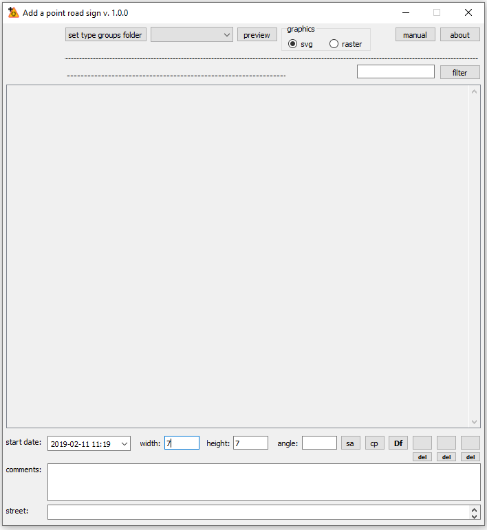

.. APRS_manual_EN documentation master file, created by
   sphinx-quickstart on Tue Oct  1 08:43:31 2019.
   You can adapt this file completely to your liking, but it should at least
   contain the root `toctree` directive.

.. toctree::
   :maxdepth: 2
   :caption: Contents:

**Instructions for using the Add_a_point_road_sign plugin (APRS) to perform traffic management projects in the QGIS program (tested on version 3.6.0).**

*Discussion of the various elements of the plugin interface (from the upper left corner):*

|10000000000002C40000030311146E0460D0FDD1_png|

#.  view of the selected road sign (type);
#.  the [set type groups folder] button is used to set the parent folder containing groups of road signs (see the folder structure "road_signs_SVG '" of this plugin);
#.  the "type groups" combo box is used to select a group of road signs displayed in the main road signs selection box;
#.  the [preview] button is used to open the window with the selected road sign in order to try / determine the most appropriate size and proportion (width and height fields) of the road sign’s view in the project;
#.  the "graphics" check box is used to determine which road signs are downloaded to the plugin, whether they will be files with vector graphics (.svg) or with raster graphics (.png, .jpg). The selection of raster graphics is available from QGIS version 3.6;
#.  the [manual] button is used to display this instruction;
#.  the [about] button is used to display general information about this plugin;
#.  below is the path of the currently opened parent folder containing groups of road signs (set with the [set type groups folder] button);
#.  the type of the selected road sign is displayed below (the name of the file);
#.  next to the right is a road sign filter window in the main road sign selection box;
#.  the [filter] button starts filtration;
#.  main road sign selection box;
#.  the "start date" field is used to set the start date of the road sign;
#.  the "width" field is used to determine the width of the road sign on the map (see the style of the "vertical_road_signs" and "supports" layers from the "Test_SHP" folder of this plugin);
#.  the "height" field is used to determine the height of the road sign on the map;
#.  the "angle" field is used to determine the angle of rotation (in degrees) of the sign on the map (if the angle is entered into this field, it will be used to enter the sign, and if this field is empty, the angle must be set when entering the road sign, ie: move the cursor over the point where you want to find the road sign, press LMB, move the cursor in the appropriate direction, release the LMB);
#.  the [sa] button is used to set the angle by indicating it on the map, eg along the curb (press LMB, move the cursor, release LMB);
#.  the [cp] button is used to copy settings from the road sign already in the project (mark the selected road sign in the project and press the [cp] button);
#.  the [Df] button is used to restore the default settings (from the Setup.py file of this plug-in);
#.  a set of six buttons for memorizing settings during operation, switching between them, and for deleting them;
#.  the "comments" field is used to enter comments about the inserted road sign;
#.  the "street" field is used to enter the name of the street to which the road sign is assigned.

*Discussing the Setup.py file of this plug-in:*

``class Setup:``

|	``WIDTH = 7``
|	``HEIGHT = 7``
|	``START_DATE = '2019-02-11T11:19'``
|	``COMMENTS = ''``

|	``COMMENTS_MAX_LENGTH = 100``
|	``STREET_NAME_MAX_LENGTH = 100``
|	``DB_FIELD_NAMES_MAPPING_DICT = {``
|		``'ROAD_SIGN_TYPE': 'type',``
|		``'ANGLE': 'angle',``
|		``'WIDTH': 'width',``
|		``'HEIGHT': 'height',``
|		``'START_DATE': 'start',``
|		``'COMMENTS': 'comments',``
|		``'STREET_NAME': 'street'``
|		``}``
|	``MANUAL_FILE_NAME = 'APRS_manual_EN.pdf'``

#.  remember that this file is a normal python script, so you need to keep all the requirements for such scripts (in particular the number of tabs at the beginning of each line, the presence of apostrophes, etc.);
#.  WIDTH, HEIGHT, START_DATE and COMMENTS settings contain the default values of the respective interface fields of this plugin;
#.  COMMENTS_MAX_LENGTH setting specifies the maximum number of characters from which a comment may be made (it should match the setting of the road sign layer for this field). The "comments" field of this plugin will not allow you to enter a longer comment (STREET_NAME_MAX_LENGTH similarly for the "street" field);
#.  setting DB_FIELD_NAMES_MAPPING_DICT is a dictionary containing data mapping from the plugin to the layers with road signs (eg, pair: 'START_DATE': 'start' means that the date from the 'start date' field of this plugin is to be saved to the field named 'start' of the layer with road signs);
#.  MANUAL_FILE_NAME setting refers to the file name in which the instruction displayed by the [manual] button (in the default program to open .pdf files) is located.

*Setting paths to folders with .SVG files containing images of road signs:*

>> Settings >> Options ... >> System >> SVG paths >> [+]

*Review the layer structure from the "Test_SHP" folder:** >> Layer Properties >> Source Fields

*Review the layer Symbology from the "Test_SHP" folder: >> Layer Properties >> Symbology*

*Example, inserting a D-6 road sign:*

#.  open the project "test_svg.qgz" from the "Test_SHP" folder of this plugin;
#.  select the "vertical_road_signs" layer;
#.  press the icon of this plugin;
#.  press the [set type groups folder] button and set the parent folder ("road_signs_SVG” folder of this plugin);
#.  in the "type groups" combo box, select the "D" group;
#.  in the main road sign selection box, select the "D-6" sign;
#.  hover the cursor over the map point where you want to place the sign, press LMB, move the cursor to the proper side, release LMB;
#.  if the road sign has not been displayed, set the corresponding SVG Image in the layer properties for the unique value "D-6";

*Additives:*

#.  graphics .png road signs can be downloaded from github.com/piotrm35/APRS_additives
#.  instructions for entering horizontal road signs (linear and surface) can be downloaded from github.com/piotrm35/APRS_additives

--------------------------------------------------------------------------------------------------------------------------------------

LMB - left mouse button

manual version: 0.4

